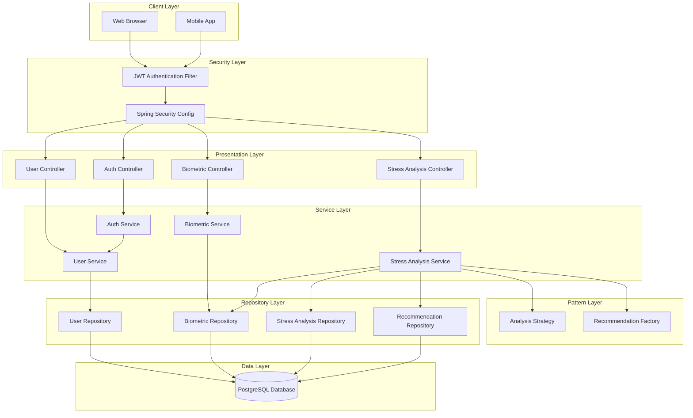
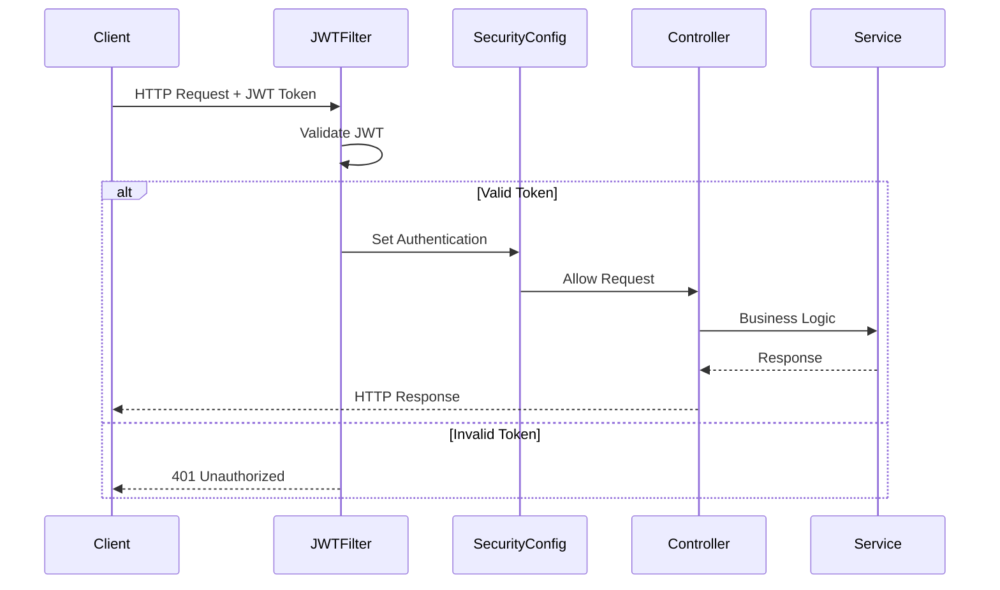

# Архітектура ПЗ та Патерни проектування
# Веб-система для аналізу біометричних показників стресу

## 1. Загальна архітектура системи

### 1.1 Шарова архітектура (Layered Architecture)

Система побудована за принципом шарової архітектури з чітким розділенням відповідальностей:

```
┌─────────────────────────────────────────────┐
│         Presentation Layer                   │
│    (Controllers, REST API Endpoints)         │
└─────────────────────────────────────────────┘
                    ↓
┌─────────────────────────────────────────────┐
│         Service Layer                        │
│      (Business Logic, Services)              │
└─────────────────────────────────────────────┘
                    ↓
┌─────────────────────────────────────────────┐
│         Repository Layer                     │
│    (Data Access, JPA Repositories)           │
└─────────────────────────────────────────────┘
                    ↓
┌─────────────────────────────────────────────┐
│         Data Layer                           │
│         (PostgreSQL Database)                │
└─────────────────────────────────────────────┘
```

#### Controller Layer (Presentation)
- `AuthController` - Аутентифікація та реєстрація
- `UserController` - Управління користувачами
- `BiometricDataController` - CRUD операції для біометричних даних
- `StressAnalysisController` - Аналіз стресу

#### Service Layer (Business Logic)
- `AuthService` - Логіка аутентифікації
- `UserService` - Бізнес-логіка користувачів
- `BiometricDataService` - Обробка біометричних даних
- `StressAnalysisService` - Аналіз та генерація рекомендацій

#### Repository Layer (Data Access)
- `UserRepository`
- `BiometricDataRepository`
- `StressAnalysisRepository`
- `RecommendationRepository`

### 1.2 Архітектурна діаграма



## 2. Принципи SOLID

### 2.1 Single Responsibility Principle (SRP)
**Принцип єдиної відповідальності**: Кожен клас має одну причину для зміни.

#### Приклади в проекті:

**UserServiceImpl** - відповідає тільки за управління користувачами:
```java
@Service
public class UserServiceImpl implements UserService {
    // Тільки логіка управління користувачами
    // Не містить логіки аутентифікації чи аналізу даних
}
```

**StressAnalysisServiceImpl** - відповідає тільки за аналіз стресу:
```java
@Service
public class StressAnalysisServiceImpl implements StressAnalysisService {
    // Тільки логіка аналізу стресу
    // Не містить логіки збереження даних чи створення користувачів
}
```

**JwtUtil** - відповідає тільки за операції з JWT токенами:
```java
@Component
public class JwtUtil {
    // Тільки генерація, валідація та парсинг JWT токенів
}
```

### 2.2 Open/Closed Principle (OCP)
**Принцип відкритості/закритості**: Класи відкриті для розширення, але закриті для модифікації.

#### Приклад: Strategy Pattern для аналізу стресу

```java
// Інтерфейс відкритий для розширення
public interface StressAnalysisStrategy {
    StressAnalysis analyze(BiometricData biometricData);
    String getStrategyName();
}

// Можна додавати нові стратегії без зміни існуючого коду
@Component
public class StandardStressAnalysisStrategy implements StressAnalysisStrategy {
    @Override
    public StressAnalysis analyze(BiometricData data) {
        // Стандартний алгоритм
    }
}

// Нова стратегія без зміни існуючих класів
@Component
public class AdvancedMLStressAnalysisStrategy implements StressAnalysisStrategy {
    @Override
    public StressAnalysis analyze(BiometricData data) {
        // ML-based алгоритм
    }
}
```

### 2.3 Liskov Substitution Principle (LSP)
**Принцип підстановки Лісков**: Підтипи повинні бути замінні на базові типи.

#### Приклад: Репозиторії

```java
// Базовий інтерфейс JpaRepository
public interface UserRepository extends JpaRepository<User, Long> {
    Optional<User> findByUsername(String username);
}

// Можна замінити на будь-яку реалізацію JpaRepository
// без порушення функціональності
```

### 2.4 Interface Segregation Principle (ISP)
**Принцип розділення інтерфейсів**: Клієнти не повинні залежати від методів, які вони не використовують.

#### Приклад: Розділені інтерфейси сервісів

```java
// Замість одного великого інтерфейсу UserManagementService
// маємо спеціалізовані інтерфейси:

public interface UserService {
    UserDTO createUser(RegisterRequest request);
    UserDTO updateUser(Long id, UserDTO userDTO);
    Optional<UserDTO> getUserById(Long id);
    // Тільки необхідні методи
}

public interface AuthService {
    AuthResponse register(RegisterRequest request);
    AuthResponse login(AuthRequest request);
    // Тільки методи аутентифікації
}
```

### 2.5 Dependency Inversion Principle (DIP)
**Принцип інверсії залежностей**: Залежність від абстракцій, а не від конкретних реалізацій.

#### Приклад: Dependency Injection

```java
@Service
@RequiredArgsConstructor  // Lombok - генерує конструктор з фінальними полями
public class StressAnalysisServiceImpl implements StressAnalysisService {

    // Залежності від абстракцій (інтерфейсів)
    private final StressAnalysisRepository stressAnalysisRepository;
    private final BiometricDataRepository biometricDataRepository;
    private final StressAnalysisStrategy analysisStrategy;  // Абстракція!
    private final RecommendationFactory recommendationFactory;

    // Spring автоматично впровадить конкретні реалізації
}
```

## 3. Патерни проектування (Design Patterns)

### 3.1 Strategy Pattern (Стратегія)
**Призначення**: Визначає сімейство алгоритмів, інкапсулює кожен з них та робить їх взаємозамінними.

#### Реалізація в проекті:

```java
// Інтерфейс стратегії
public interface StressAnalysisStrategy {
    StressAnalysis analyze(BiometricData biometricData);
    String getStrategyName();
}

// Конкретна стратегія
@Component
public class StandardStressAnalysisStrategy implements StressAnalysisStrategy {

    private static final double CARDIOVASCULAR_WEIGHT = 0.30;
    private static final double THERMAL_WEIGHT = 0.15;
    private static final double BIOCHEMICAL_WEIGHT = 0.25;
    private static final double SLEEP_WEIGHT = 0.20;
    private static final double RESPIRATORY_WEIGHT = 0.10;

    @Override
    public StressAnalysis analyze(BiometricData data) {
        double cardiovascularScore = calculateCardiovascularScore(data);
        double thermalScore = calculateThermalScore(data);
        // ... розрахунок інших показників

        double totalScore = (cardiovascularScore * CARDIOVASCULAR_WEIGHT) +
                           (thermalScore * THERMAL_WEIGHT) +
                           // ... інші компоненти

        return StressAnalysis.builder()
                .stressScore(totalScore)
                .stressLevel(StressAnalysis.determineStressLevel(totalScore))
                .build();
    }
}

// Використання в сервісі
@Service
public class StressAnalysisServiceImpl {
    private final StressAnalysisStrategy analysisStrategy;

    public StressAnalysisDTO analyzeStress(Long biometricDataId) {
        BiometricData data = // ... отримати дані
        StressAnalysis analysis = analysisStrategy.analyze(data);
        // ...
    }
}
```

**Переваги**:
- Можна легко додати нові алгоритми аналізу
- Можна змінювати алгоритм в runtime
- Код відповідає Open/Closed принципу

### 3.2 Factory Pattern (Фабрика)
**Призначення**: Визначає інтерфейс для створення об'єкта, але дозволяє підкласам вирішувати, який клас інстанціювати.

#### Реалізація в проекті:

```java
@Component
public class RecommendationFactory {

    public List<Recommendation> createRecommendations(StressAnalysis analysis) {
        List<Recommendation> recommendations = new ArrayList<>();

        // Вибір методу створення на основі рівня стресу
        switch (analysis.getStressLevel()) {
            case LOW -> recommendations.addAll(createLowStressRecommendations());
            case MODERATE -> recommendations.addAll(createModerateStressRecommendations());
            case HIGH -> recommendations.addAll(createHighStressRecommendations());
            case CRITICAL -> recommendations.addAll(createCriticalStressRecommendations());
        }

        // Додаткові рекомендації на основі компонентів
        if (analysis.getCardiovascularScore() > 50) {
            recommendations.add(createCardiovascularRecommendation());
        }

        return recommendations;
    }

    private List<Recommendation> createCriticalStressRecommendations() {
        List<Recommendation> recommendations = new ArrayList<>();

        recommendations.add(Recommendation.builder()
                .category(Recommendation.Category.MEDICAL)
                .title("ТЕРМІНОВА медична консультація")
                .description("КРИТИЧНИЙ рівень стресу! Терміново зверніться до лікаря.")
                .priority(Recommendation.Priority.URGENT)
                .build());

        return recommendations;
    }
}
```

**Переваги**:
- Інкапсулює логіку створення об'єктів
- Легко додавати нові типи рекомендацій
- Централізоване створення об'єктів

### 3.3 Repository Pattern (Репозиторій)
**Призначення**: Абстракція для доступу до даних, інкапсулює логіку роботи з базою даних.

#### Реалізація в проекті:

```java
@Repository
public interface UserRepository extends JpaRepository<User, Long> {
    Optional<User> findByUsername(String username);
    Optional<User> findByEmail(String email);
    Boolean existsByUsername(String username);
    Boolean existsByEmail(String email);

    @Query("SELECT u FROM User u LEFT JOIN FETCH u.biometricDataList WHERE u.id = :id")
    Optional<User> findByIdWithBiometricData(@Param("id") Long id);
}
```

**Переваги**:
- Абстракція від конкретної реалізації збереження даних
- Можливість легкої зміни БД або ORM
- Тестування за допомогою mock об'єктів

### 3.4 Builder Pattern (Будівельник)
**Призначення**: Відокремлює конструювання складного об'єкта від його представлення.

#### Реалізація в проекті:

```java
@Entity
@Builder  // Lombok генерує builder
public class User extends BaseEntity {
    private String username;
    private String email;
    private String password;
    // ... інші поля
}

// Використання
User user = User.builder()
        .username("john_doe")
        .email("john@example.com")
        .password(encodedPassword)
        .firstName("John")
        .lastName("Doe")
        .role(User.Role.USER)
        .active(true)
        .build();
```

**Переваги**:
- Читабельність коду
- Можливість створення immutable об'єктів
- Гнучкість при створенні об'єктів з багатьма параметрами

### 3.5 Chain of Responsibility (Ланцюжок відповідальності)
**Призначення**: Передає запит по ланцюгу обробників.

#### Реалізація в проекті:

```java
@Component
public class JwtAuthenticationFilter extends OncePerRequestFilter {

    @Override
    protected void doFilterInternal(HttpServletRequest request,
                                    HttpServletResponse response,
                                    FilterChain filterChain) throws ServletException, IOException {
        try {
            String jwt = getJwtFromRequest(request);

            if (StringUtils.hasText(jwt)) {
                String username = jwtUtil.extractUsername(jwt);

                if (username != null && SecurityContextHolder.getContext().getAuthentication() == null) {
                    UserDetails userDetails = userDetailsService.loadUserByUsername(username);

                    if (jwtUtil.validateToken(jwt, userDetails)) {
                        // Встановлюємо аутентифікацію
                        UsernamePasswordAuthenticationToken authentication =
                            new UsernamePasswordAuthenticationToken(
                                userDetails, null, userDetails.getAuthorities());
                        SecurityContextHolder.getContext().setAuthentication(authentication);
                    }
                }
            }
        } catch (Exception ex) {
            logger.error("Could not set user authentication in security context", ex);
        }

        // Передаємо запит далі по ланцюгу
        filterChain.doFilter(request, response);
    }
}
```

**Переваги**:
- Зменшення зв'язаності між відправником та отримувачем
- Можливість додавання нових обробників без зміни існуючого коду

### 3.6 Adapter Pattern (Адаптер)
**Призначення**: Перетворює інтерфейс класу в інший інтерфейс, який очікується клієнтом.

#### Реалізація в проекті:

```java
@Service
@RequiredArgsConstructor
public class CustomUserDetailsService implements UserDetailsService {
    private final UserRepository userRepository;

    @Override
    public UserDetails loadUserByUsername(String username) throws UsernameNotFoundException {
        User user = userRepository.findByUsername(username)
                .orElseThrow(() -> new UsernameNotFoundException("User not found: " + username));

        // Адаптуємо нашу Entity User до Spring Security UserDetails
        return org.springframework.security.core.userdetails.User.builder()
                .username(user.getUsername())
                .password(user.getPassword())
                .authorities(Collections.singletonList(
                        new SimpleGrantedAuthority("ROLE_" + user.getRole().name())))
                .accountExpired(false)
                .accountLocked(!user.getActive())
                .credentialsExpired(false)
                .disabled(!user.getActive())
                .build();
    }
}
```

**Переваги**:
- Інтеграція з існуючими системами (Spring Security)
- Відповідність Dependency Inversion Principle

### 3.7 Singleton Pattern (Одинак)
**Призначення**: Забезпечує, що клас має тільки один екземпляр.

#### Реалізація в проекті:

Spring автоматично створює singleton bean'и:

```java
@Service  // Spring створює один екземпляр для всього додатку
public class UserServiceImpl implements UserService {
    // ...
}

@Component  // Також singleton за замовчуванням
public class JwtUtil {
    // ...
}
```

## 4. Безпека та best practices

### 4.1 Security Architecture



### 4.2 Exception Handling

Централізована обробка винятків за допомогою `@RestControllerAdvice`:

```java
@RestControllerAdvice
public class GlobalExceptionHandler {

    @ExceptionHandler(ResourceNotFoundException.class)
    public ResponseEntity<ErrorResponse> handleResourceNotFoundException(
            ResourceNotFoundException ex) {
        ErrorResponse error = ErrorResponse.builder()
                .timestamp(LocalDateTime.now())
                .status(HttpStatus.NOT_FOUND.value())
                .error("Not Found")
                .message(ex.getMessage())
                .build();
        return new ResponseEntity<>(error, HttpStatus.NOT_FOUND);
    }

    // ... інші обробники
}
```

## 5. Висновки

Архітектура системи побудована з використанням:

1. **SOLID принципів** для забезпечення гнучкості та підтримуваності
2. **Патернів проектування** для розв'язання типових задач
3. **Шарової архітектури** для розділення відповідальностей
4. **Spring Framework** для dependency injection та конфігурації
5. **JWT Security** для захисту API

Така архітектура забезпечує:
- ✅ Легку підтримуваність коду
- ✅ Можливість розширення функціональності
- ✅ Тестованість компонентів
- ✅ Масштабованість системи
- ✅ Безпеку даних користувачів
