# Діаграма бази даних
# ORM моделі та структура БД

## ER-діаграма (Mermaid)

```mermaid
erDiagram
    USERS ||--o{ BIOMETRIC_DATA : has
    USERS ||--o{ STRESS_ANALYSIS : has
    BIOMETRIC_DATA ||--|| STRESS_ANALYSIS : analyzed_by
    STRESS_ANALYSIS ||--o{ RECOMMENDATIONS : generates

    USERS {
        bigint id PK
        varchar username UK
        varchar email UK
        varchar password
        varchar first_name
        varchar last_name
        varchar gender
        date date_of_birth
        int age
        varchar phone_number
        varchar role
        boolean active
        timestamp created_at
        timestamp updated_at
        bigint version
    }

    BIOMETRIC_DATA {
        bigint id PK
        bigint user_id FK
        timestamp measurement_time
        int heart_rate
        int systolic_pressure
        int diastolic_pressure
        double body_temperature
        double cortisol_level
        double sleep_hours
        varchar sleep_quality
        int respiratory_rate
        double oxygen_saturation
        int activity_level
        varchar notes
        timestamp created_at
        timestamp updated_at
        bigint version
    }

    STRESS_ANALYSIS {
        bigint id PK
        bigint user_id FK
        bigint biometric_data_id FK
        varchar stress_level
        double stress_score
        double cardiovascular_score
        double thermal_score
        double biochemical_score
        double sleep_score
        double respiratory_score
        text analysis
        timestamp created_at
        timestamp updated_at
        bigint version
    }

    RECOMMENDATIONS {
        bigint id PK
        bigint stress_analysis_id FK
        varchar category
        varchar title
        text description
        varchar priority
        boolean completed
        timestamp created_at
        timestamp updated_at
        bigint version
    }
```



## Опис таблиць

### 1. USERS (Користувачі)
Зберігає інформацію про користувачів системи.

**Поля:**
- `id` - Унікальний ідентифікатор (Primary Key)
- `username` - Ім'я користувача (Unique)
- `email` - Email (Unique)
- `password` - Зашифрований пароль (BCrypt)
- `first_name` - Ім'я
- `last_name` - Прізвище
- `gender` - Стать (MALE, FEMALE, OTHER)
- `date_of_birth` - Дата народження
- `age` - Вік (обчислюється автоматично)
- `phone_number` - Номер телефону
- `role` - Роль (USER, DOCTOR, ADMIN)
- `active` - Чи активний користувач
- `created_at` - Дата створення
- `updated_at` - Дата оновлення
- `version` - Версія для оптимістичної блокування

**Індекси:**
- `idx_email` на полі `email`
- `idx_username` на полі `username`

### 2. BIOMETRIC_DATA (Біометричні дані)
Зберігає біометричні показники користувачів.

**Поля:**
- `id` - Унікальний ідентифікатор (Primary Key)
- `user_id` - Посилання на користувача (Foreign Key)
- `measurement_time` - Час вимірювання
- `heart_rate` - Частота серцевих скорочень (уд/хв)
- `systolic_pressure` - Систолічний тиск (мм рт. ст.)
- `diastolic_pressure` - Діастолічний тиск (мм рт. ст.)
- `body_temperature` - Температура тіла (°C)
- `cortisol_level` - Рівень кортизолу (nmol/L)
- `sleep_hours` - Тривалість сну (години)
- `sleep_quality` - Якість сну (POOR, FAIR, GOOD, EXCELLENT)
- `respiratory_rate` - Частота дихання (вдихи/хв)
- `oxygen_saturation` - Насичення кисню (%)
- `activity_level` - Рівень активності (кроки або хвилини)
- `notes` - Додаткові нотатки

**Індекси:**
- `idx_user_measurement` на полях `user_id, measurement_time`
- `idx_measurement_time` на полі `measurement_time`

### 3. STRESS_ANALYSIS (Аналіз стресу)
Зберігає результати аналізу рівня стресу.

**Поля:**
- `id` - Унікальний ідентифікатор (Primary Key)
- `user_id` - Посилання на користувача (Foreign Key)
- `biometric_data_id` - Посилання на біометричні дані (Foreign Key)
- `stress_level` - Рівень стресу (LOW, MODERATE, HIGH, CRITICAL)
- `stress_score` - Загальний індекс стресу (0-100)
- `cardiovascular_score` - Оцінка серцево-судинної системи
- `thermal_score` - Оцінка термальних показників
- `biochemical_score` - Оцінка біохімічних показників
- `sleep_score` - Оцінка якості сну
- `respiratory_score` - Оцінка дихальної системи
- `analysis` - Текстовий аналіз результатів

**Індекси:**
- `idx_user_stress` на полях `user_id, stress_level`
- `idx_analysis_date` на полі `created_at`

### 4. RECOMMENDATIONS (Рекомендації)
Зберігає персоналізовані рекомендації для користувачів.

**Поля:**
- `id` - Унікальний ідентифікатор (Primary Key)
- `stress_analysis_id` - Посилання на аналіз стресу (Foreign Key)
- `category` - Категорія (PHYSICAL_ACTIVITY, NUTRITION, SLEEP, RELAXATION, MEDICAL, LIFESTYLE)
- `title` - Заголовок рекомендації
- `description` - Детальний опис
- `priority` - Пріоритет (LOW, MEDIUM, HIGH, URGENT)
- `completed` - Чи виконана рекомендація

**Індекси:**
- `idx_stress_analysis` на полі `stress_analysis_id`
- `idx_category` на полі `category`

## Зв'язки між таблицями

### One-to-Many зв'язки:
1. **USERS → BIOMETRIC_DATA**
   - Один користувач може мати багато біометричних записів
   - Cascade: ALL, orphanRemoval: true

2. **USERS → STRESS_ANALYSIS**
   - Один користувач може мати багато аналізів стресу
   - Cascade: ALL, orphanRemoval: true

3. **STRESS_ANALYSIS → RECOMMENDATIONS**
   - Один аналіз стресу може мати багато рекомендацій
   - Cascade: ALL, orphanRemoval: true

### One-to-One зв'язки:
1. **BIOMETRIC_DATA → STRESS_ANALYSIS**
   - Кожен запис біометричних даних може мати один аналіз стресу
   - Cascade: ALL, orphanRemoval: true

## SQL DDL для створення таблиць

```sql
-- Таблиця користувачів
CREATE TABLE users (
    id BIGSERIAL PRIMARY KEY,
    username VARCHAR(50) NOT NULL UNIQUE,
    email VARCHAR(100) NOT NULL UNIQUE,
    password VARCHAR(255) NOT NULL,
    first_name VARCHAR(100) NOT NULL,
    last_name VARCHAR(100) NOT NULL,
    gender VARCHAR(10),
    date_of_birth DATE,
    age INTEGER,
    phone_number VARCHAR(20),
    role VARCHAR(20) NOT NULL DEFAULT 'USER',
    active BOOLEAN NOT NULL DEFAULT TRUE,
    created_at TIMESTAMP NOT NULL DEFAULT CURRENT_TIMESTAMP,
    updated_at TIMESTAMP NOT NULL DEFAULT CURRENT_TIMESTAMP,
    version BIGINT DEFAULT 0
);

CREATE INDEX idx_email ON users(email);
CREATE INDEX idx_username ON users(username);

-- Таблиця біометричних даних
CREATE TABLE biometric_data (
    id BIGSERIAL PRIMARY KEY,
    user_id BIGINT NOT NULL,
    measurement_time TIMESTAMP NOT NULL,
    heart_rate INTEGER NOT NULL,
    systolic_pressure INTEGER NOT NULL,
    diastolic_pressure INTEGER NOT NULL,
    body_temperature DOUBLE PRECISION NOT NULL,
    cortisol_level DOUBLE PRECISION,
    sleep_hours DOUBLE PRECISION,
    sleep_quality VARCHAR(20),
    respiratory_rate INTEGER,
    oxygen_saturation DOUBLE PRECISION,
    activity_level INTEGER,
    notes VARCHAR(500),
    created_at TIMESTAMP NOT NULL DEFAULT CURRENT_TIMESTAMP,
    updated_at TIMESTAMP NOT NULL DEFAULT CURRENT_TIMESTAMP,
    version BIGINT DEFAULT 0,
    FOREIGN KEY (user_id) REFERENCES users(id) ON DELETE CASCADE
);

CREATE INDEX idx_user_measurement ON biometric_data(user_id, measurement_time);
CREATE INDEX idx_measurement_time ON biometric_data(measurement_time);

-- Таблиця аналізу стресу
CREATE TABLE stress_analysis (
    id BIGSERIAL PRIMARY KEY,
    user_id BIGINT NOT NULL,
    biometric_data_id BIGINT NOT NULL,
    stress_level VARCHAR(20) NOT NULL,
    stress_score DOUBLE PRECISION NOT NULL,
    cardiovascular_score DOUBLE PRECISION,
    thermal_score DOUBLE PRECISION,
    biochemical_score DOUBLE PRECISION,
    sleep_score DOUBLE PRECISION,
    respiratory_score DOUBLE PRECISION,
    analysis TEXT,
    created_at TIMESTAMP NOT NULL DEFAULT CURRENT_TIMESTAMP,
    updated_at TIMESTAMP NOT NULL DEFAULT CURRENT_TIMESTAMP,
    version BIGINT DEFAULT 0,
    FOREIGN KEY (user_id) REFERENCES users(id) ON DELETE CASCADE,
    FOREIGN KEY (biometric_data_id) REFERENCES biometric_data(id) ON DELETE CASCADE
);

CREATE INDEX idx_user_stress ON stress_analysis(user_id, stress_level);
CREATE INDEX idx_analysis_date ON stress_analysis(created_at);

-- Таблиця рекомендацій
CREATE TABLE recommendations (
    id BIGSERIAL PRIMARY KEY,
    stress_analysis_id BIGINT NOT NULL,
    category VARCHAR(50) NOT NULL,
    title VARCHAR(200) NOT NULL,
    description VARCHAR(1000) NOT NULL,
    priority VARCHAR(20) NOT NULL,
    completed BOOLEAN DEFAULT FALSE,
    created_at TIMESTAMP NOT NULL DEFAULT CURRENT_TIMESTAMP,
    updated_at TIMESTAMP NOT NULL DEFAULT CURRENT_TIMESTAMP,
    version BIGINT DEFAULT 0,
    FOREIGN KEY (stress_analysis_id) REFERENCES stress_analysis(id) ON DELETE CASCADE
);

CREATE INDEX idx_stress_analysis ON recommendations(stress_analysis_id);
CREATE INDEX idx_category ON recommendations(category);
```

## Нормалізація бази даних

База даних знаходиться в **третій нормальній формі (3NF)**:

1. **1NF**: Всі атрибути атомарні, немає повторюваних груп
2. **2NF**: Всі неключові атрибути повністю залежать від первинного ключа
3. **3NF**: Відсутні транзитивні залежності

## Оптимізація

1. **Індекси** створені на часто використовуваних полях для пошуку
2. **Cascade операції** налаштовані для забезпечення цілісності даних
3. **Version поле** для оптимістичної блокування (запобігання конфліктів при concurrent updates)
4. **Lazy loading** для зв'язаних сутностей для оптимізації продуктивності
