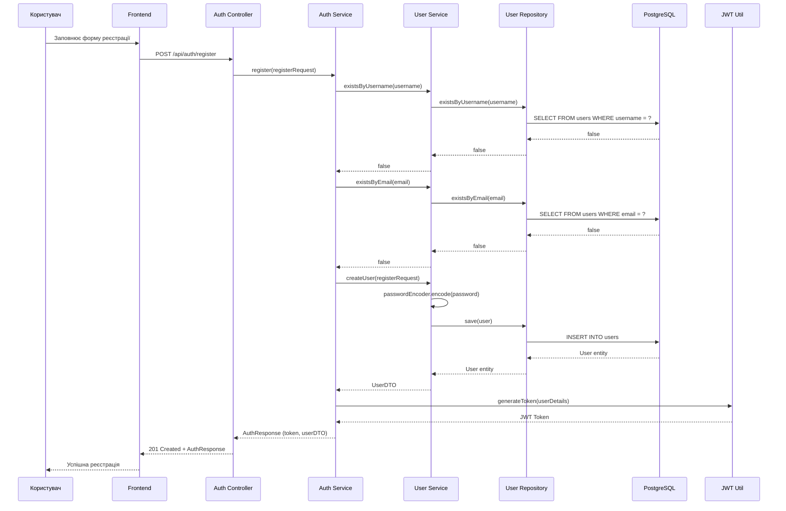
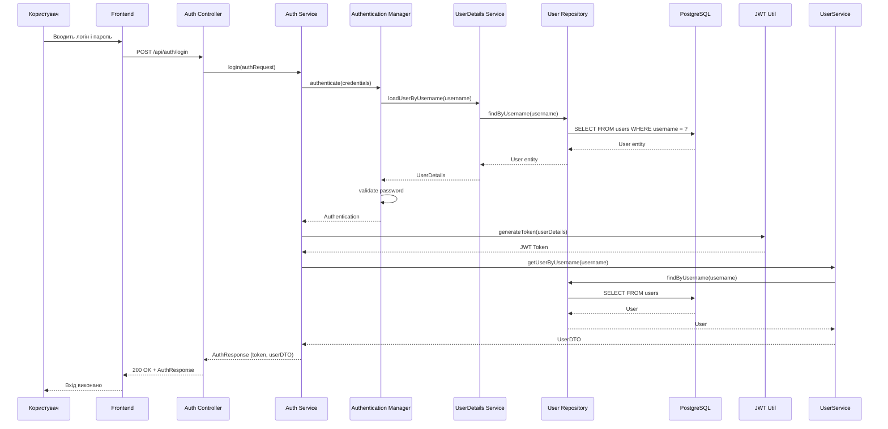
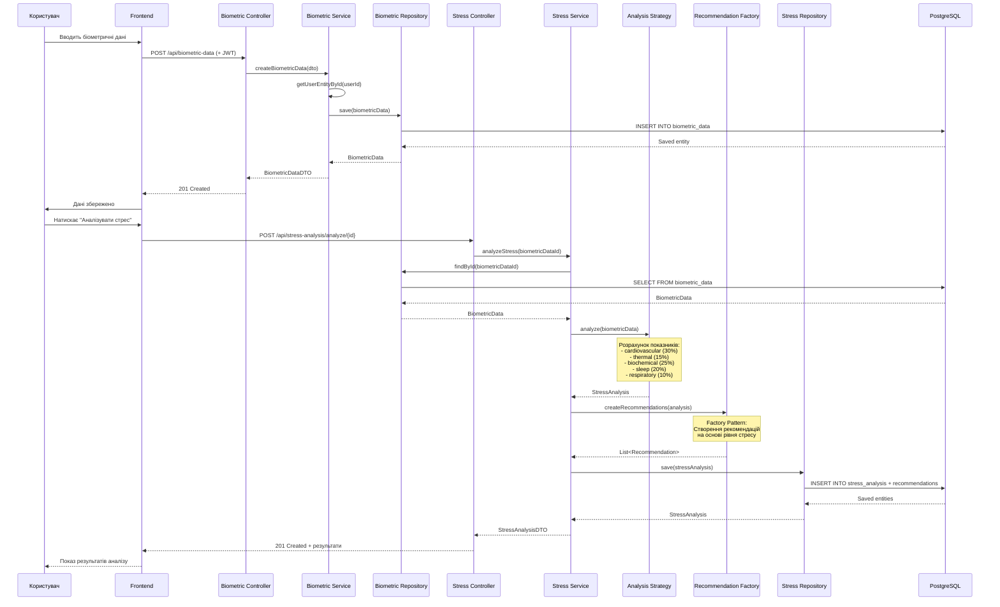
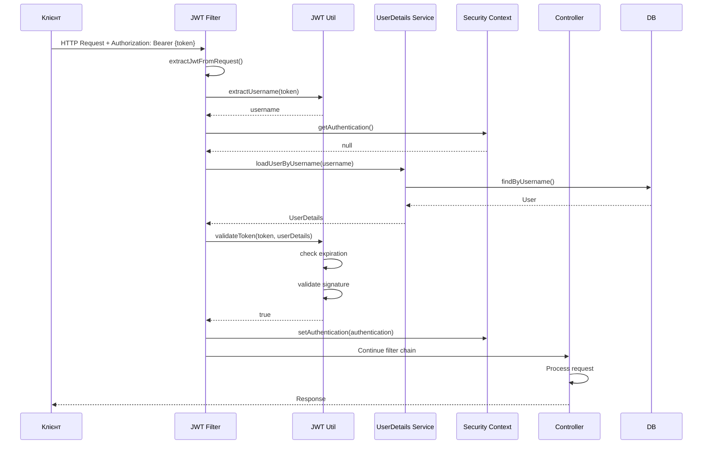
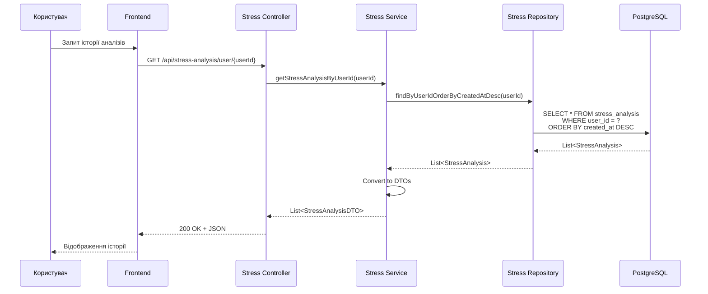

# Sequence Діаграми
# Головні процеси системи

## 1. Процес реєстрації користувача

## 2. Процес авторизації

## 3. Процес введення біометричних даних та аналізу стресу

## 4. Процес аутентифікації з JWT

## 5. Процес отримання історії аналізів

## Опис патернів у Sequence діаграмах

### 1. Strategy Pattern (AnalysisStrategy)
Використовується для реалізації різних алгоритмів аналізу стресу. Поточна реалізація - StandardStressAnalysisStrategy, але можна додати інші стратегії без зміни коду.

### 2. Factory Pattern (RecommendationFactory)
Створює рекомендації на основі результатів аналізу стресу. Інкапсулює логіку створення різних типів рекомендацій.

### 3. Chain of Responsibility (JWT Filter)
JWT фільтр перевіряє токен та передає запит далі по ланцюгу фільтрів Spring Security.

### 4. Repository Pattern
Абстракція доступу до даних через репозиторії, що дозволяє легко змінювати реалізацію збереження даних.
