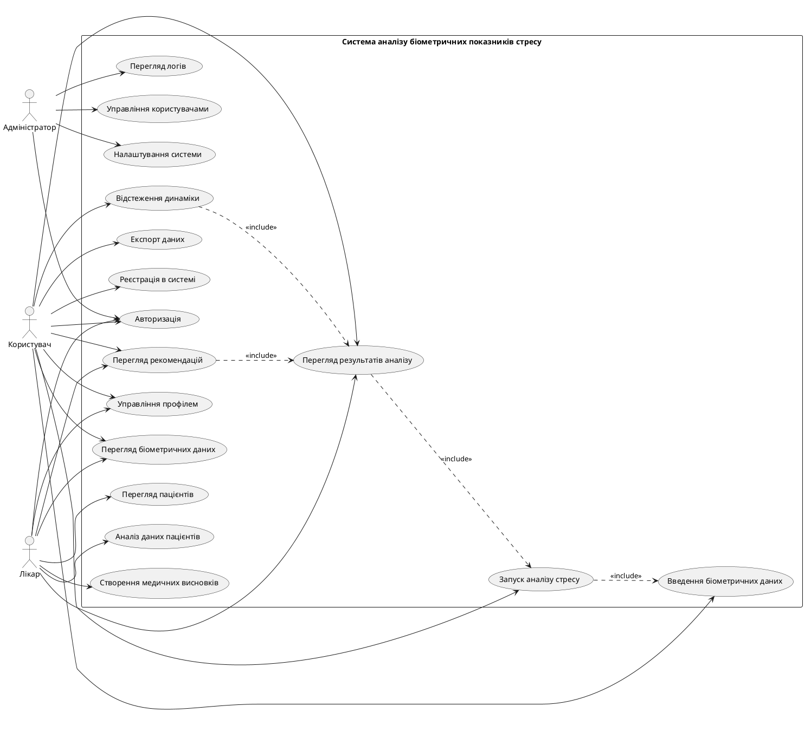
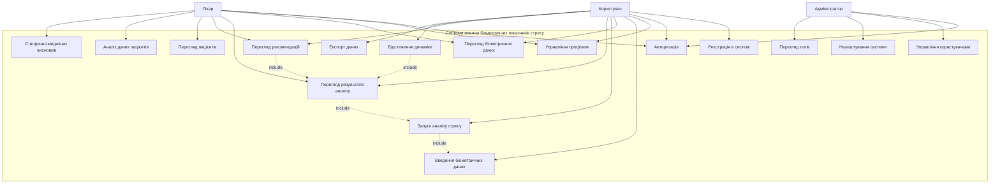

# Use Case Діаграма
# Веб-система для аналізу біометричних показників стресу

## PlantUML код діаграми

## Mermaid діаграма

## Опис Use Cases

### UC1: Реєстрація в системі
**Актори:** Користувач
**Опис:** Новий користувач реєструється в системі, вказуючи особисту інформацію та створюючи облікові дані.

### UC2: Авторизація
**Актори:** Користувач, Лікар, Адміністратор
**Опис:** Вхід в систему за допомогою логіну та паролю. Система видає JWT токен.

### UC3: Управління профілем
**Актори:** Користувач, Лікар
**Опис:** Редагування особистої інформації, зміна налаштувань профілю.

### UC4: Введення біометричних даних
**Актори:** Користувач
**Опис:** Користувач вводить біометричні показники: пульс, тиск, температуру, якість сну тощо.

### UC5: Перегляд біометричних даних
**Актори:** Користувач, Лікар
**Опис:** Перегляд історії введених біометричних показників.

### UC6: Запуск аналізу стресу
**Актори:** Користувач
**Передумови:** Наявність біометричних даних
**Опис:** Система аналізує біометричні дані та розраховує рівень стресу.

### UC7: Перегляд результатів аналізу
**Актори:** Користувач, Лікар
**Опис:** Перегляд результатів аналізу стресу з детальними показниками.

### UC8: Перегляд рекомендацій
**Актори:** Користувач, Лікар
**Опис:** Перегляд персоналізованих рекомендацій для зниження рівня стресу.

### UC9: Відстеження динаміки
**Актори:** Користувач
**Опис:** Перегляд графіків зміни рівня стресу в часі.

### UC10: Експорт даних
**Актори:** Користувач
**Опис:** Експорт біометричних даних та аналізів у файл.

### UC11: Перегляд пацієнтів
**Актори:** Лікар
**Опис:** Лікар переглядає список своїх пацієнтів.

### UC12: Аналіз даних пацієнтів
**Актори:** Лікар
**Опис:** Детальний аналіз біометричних даних пацієнтів.

### UC13: Створення медичних висновків
**Актори:** Лікар
**Опис:** Лікар створює медичні висновки на основі аналізу.

### UC14: Управління користувачами
**Актори:** Адміністратор
**Опис:** Адміністратор керує користувачами системи (створення, редагування, видалення).

### UC15: Налаштування системи
**Актори:** Адміністратор
**Опис:** Конфігурація параметрів системи.

### UC16: Перегляд логів
**Актори:** Адміністратор
**Опис:** Перегляд системних логів для моніторингу та діагностики.
