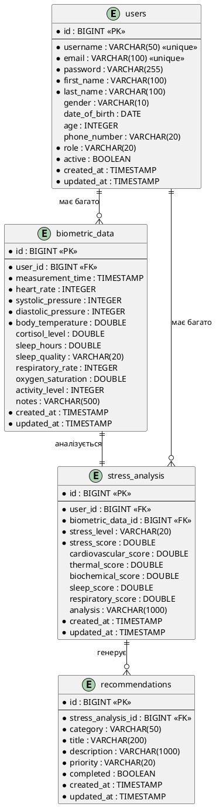

# Структура бази даних та ORM
## Система аналізу біометричних показників стресу

---

## Зміст
1. [Загальна інформація](#1-загальна-інформація)
2. [ER діаграма](#2-er-діаграма)
3. [Опис таблиць](#3-опис-таблиць)
4. [ORM маппінг (Entity класи)](#4-orm-маппінг-entity-класи)
5. [Індекси та оптимізація](#5-індекси-та-оптимізація)
6. [Зв'язки між таблицями](#6-звязки-між-таблицями)
7. [Repository Pattern](#7-repository-pattern)

---

## 1. Загальна інформація

### 1.1. СКБД
- **PostgreSQL 16** - реляційна база даних
- **Hibernate** - ORM фреймворк
- **Spring Data JPA** - абстракція для роботи з БД
- **DDL-auto**: `update` - автоматичне оновлення схеми

### 1.2. Особливості
- Використання JPA анотацій для маппінгу
- Автоматична генерація ID (auto-increment)
- Аудит полів (created_at, updated_at) через BaseEntity
- Індекси для швидких запитів
- Каскадне видалення залежних записів
- Enum типи для категоризації

---

## 2. ER діаграма



---

## 3. Опис таблиць

### 3.1. Таблиця `users`

**Призначення**: Зберігання інформації про користувачів системи

| Поле | Тип | Обмеження | Опис |
|------|-----|-----------|------|
| id | BIGINT | PK, AUTO_INCREMENT | Унікальний ідентифікатор |
| username | VARCHAR(50) | NOT NULL, UNIQUE | Ім'я користувача для входу |
| email | VARCHAR(100) | NOT NULL, UNIQUE | Електронна пошта |
| password | VARCHAR(255) | NOT NULL | Хешований пароль (BCrypt) |
| first_name | VARCHAR(100) | NOT NULL | Ім'я |
| last_name | VARCHAR(100) | NOT NULL | Прізвище |
| gender | VARCHAR(10) | NULL | Стать (MALE, FEMALE, OTHER) |
| date_of_birth | DATE | NULL | Дата народження |
| age | INTEGER | NULL | Вік (розраховується автоматично) |
| phone_number | VARCHAR(20) | NULL | Номер телефону |
| role | VARCHAR(20) | NOT NULL | Роль (USER, DOCTOR, ADMIN) |
| active | BOOLEAN | NOT NULL | Статус активності |
| created_at | TIMESTAMP | NOT NULL | Дата створення |
| updated_at | TIMESTAMP | NOT NULL | Дата останнього оновлення |

**Індекси**:
- `idx_email` на поле `email` (для швидкого пошуку при логіні)
- `idx_username` на поле `username` (для швидкого пошуку при логіні)

**Приклад запису**:
```sql
INSERT INTO users (id, username, email, password, first_name, last_name, role, active, created_at, updated_at)
VALUES (1, 'john_doe', 'john@example.com', '$2a$10$...', 'John', 'Doe', 'USER', true, NOW(), NOW());
```

---

### 3.2. Таблиця `biometric_data`

**Призначення**: Зберігання біометричних показників користувачів

| Поле | Тип | Обмеження | Опис |
|------|-----|-----------|------|
| id | BIGINT | PK, AUTO_INCREMENT | Унікальний ідентифікатор |
| user_id | BIGINT | NOT NULL, FK | Посилання на користувача |
| measurement_time | TIMESTAMP | NOT NULL | Час вимірювання |
| heart_rate | INTEGER | NOT NULL | Пульс (уд/хв), 40-200 |
| systolic_pressure | INTEGER | NOT NULL | Систолічний тиск (мм рт. ст.), 80-200 |
| diastolic_pressure | INTEGER | NOT NULL | Діастолічний тиск (мм рт. ст.), 40-130 |
| body_temperature | DOUBLE | NOT NULL | Температура тіла (°C), 35.0-42.0 |
| cortisol_level | DOUBLE | NULL | Рівень кортизолу (нмоль/л), 0-1000 |
| sleep_hours | DOUBLE | NULL | Кількість годин сну, 0-24 |
| sleep_quality | VARCHAR(20) | NULL | Якість сну (POOR/FAIR/GOOD/EXCELLENT) |
| respiratory_rate | INTEGER | NULL | Частота дихання (вдихів/хв), 8-40 |
| oxygen_saturation | DOUBLE | NULL | Сатурація кисню (%), 70-100 |
| activity_level | INTEGER | NULL | Рівень активності (кроків/хвилин) |
| notes | VARCHAR(500) | NULL | Примітки користувача |
| created_at | TIMESTAMP | NOT NULL | Дата створення |
| updated_at | TIMESTAMP | NOT NULL | Дата останнього оновлення |

**Індекси**:
- `idx_user_measurement` на поля `user_id, measurement_time` (композитний індекс)
- `idx_measurement_time` на поле `measurement_time`

**Foreign Keys**:
- `user_id` → `users.id` (ON DELETE CASCADE)

**Приклад запису**:
```sql
INSERT INTO biometric_data (user_id, measurement_time, heart_rate, systolic_pressure,
                             diastolic_pressure, body_temperature, created_at, updated_at)
VALUES (1, NOW(), 75, 120, 80, 36.6, NOW(), NOW());
```

---

### 3.3. Таблиця `stress_analysis`

**Призначення**: Зберігання результатів аналізу стресу

| Поле | Тип | Обмеження | Опис |
|------|-----|-----------|------|
| id | BIGINT | PK, AUTO_INCREMENT | Унікальний ідентифікатор |
| user_id | BIGINT | NOT NULL, FK | Посилання на користувача |
| biometric_data_id | BIGINT | NOT NULL, FK | Посилання на біометричні дані |
| stress_level | VARCHAR(20) | NOT NULL | Рівень стресу (LOW/MODERATE/HIGH/CRITICAL) |
| stress_score | DOUBLE | NOT NULL | Загальна оцінка стресу (0-100) |
| cardiovascular_score | DOUBLE | NULL | Серцево-судинна оцінка (0-100) |
| thermal_score | DOUBLE | NULL | Термальна оцінка (0-100) |
| biochemical_score | DOUBLE | NULL | Біохімічна оцінка (0-100) |
| sleep_score | DOUBLE | NULL | Оцінка сну (0-100) |
| respiratory_score | DOUBLE | NULL | Респіраторна оцінка (0-100) |
| analysis | VARCHAR(1000) | NULL | Текстовий опис аналізу |
| created_at | TIMESTAMP | NOT NULL | Дата створення |
| updated_at | TIMESTAMP | NOT NULL | Дата останнього оновлення |

**Індекси**:
- `idx_user_stress` на поля `user_id, stress_level` (композитний індекс)
- `idx_analysis_date` на поле `created_at`

**Foreign Keys**:
- `user_id` → `users.id` (ON DELETE CASCADE)
- `biometric_data_id` → `biometric_data.id` (ON DELETE CASCADE)

**Приклад запису**:
```sql
INSERT INTO stress_analysis (user_id, biometric_data_id, stress_level, stress_score,
                              cardiovascular_score, created_at, updated_at)
VALUES (1, 1, 'LOW', 22.5, 20.0, NOW(), NOW());
```

---

### 3.4. Таблиця `recommendations`

**Призначення**: Зберігання рекомендацій для користувачів

| Поле | Тип | Обмеження | Опис |
|------|-----|-----------|------|
| id | BIGINT | PK, AUTO_INCREMENT | Унікальний ідентифікатор |
| stress_analysis_id | BIGINT | NOT NULL, FK | Посилання на аналіз |
| category | VARCHAR(50) | NOT NULL | Категорія рекомендації |
| title | VARCHAR(200) | NOT NULL | Заголовок |
| description | VARCHAR(1000) | NOT NULL | Детальний опис |
| priority | VARCHAR(20) | NOT NULL | Пріоритет (LOW/MEDIUM/HIGH/URGENT) |
| completed | BOOLEAN | NOT NULL | Статус виконання |
| created_at | TIMESTAMP | NOT NULL | Дата створення |
| updated_at | TIMESTAMP | NOT NULL | Дата останнього оновлення |

**Категорії** (enum Category):
- PHYSICAL_ACTIVITY - Фізична активність
- NUTRITION - Харчування
- SLEEP - Сон
- RELAXATION - Релаксація
- MEDICAL - Медична консультація
- LIFESTYLE - Стиль життя

**Індекси**:
- `idx_stress_analysis` на поле `stress_analysis_id`
- `idx_category` на поле `category`

**Foreign Keys**:
- `stress_analysis_id` → `stress_analysis.id` (ON DELETE CASCADE)

**Приклад запису**:
```sql
INSERT INTO recommendations (stress_analysis_id, category, title, description, priority,
                              completed, created_at, updated_at)
VALUES (1, 'PHYSICAL_ACTIVITY', 'Ранкова зарядка', 'Виконуйте легкі вправи протягом 15 хвилин',
        'MEDIUM', false, NOW(), NOW());
```

---

## 4. ORM маппінг (Entity класи)

### 4.1. BaseEntity

Абстрактний базовий клас для всіх Entity з аудит полями:

```java
@MappedSuperclass
@Getter
@Setter
public abstract class BaseEntity {
    @Id
    @GeneratedValue(strategy = GenerationType.IDENTITY)
    private Long id;

    @CreationTimestamp
    @Column(nullable = false, updatable = false)
    private LocalDateTime createdAt;

    @UpdateTimestamp
    @Column(nullable = false)
    private LocalDateTime updatedAt;
}
```

**Особливості**:
- `@MappedSuperclass` - поля будуть успадковані дочірніми Entity
- `@GeneratedValue(IDENTITY)` - auto-increment ID
- `@CreationTimestamp` - автоматично встановлює час створення
- `@UpdateTimestamp` - автоматично оновлює час модифікації

---

### 4.2. User Entity

**Файл**: `backend/src/main/java/com/biometric/stressanalysis/entity/User.java`

```java
@Entity
@Table(name = "users", indexes = {
    @Index(name = "idx_email", columnList = "email"),
    @Index(name = "idx_username", columnList = "username")
})
public class User extends BaseEntity {
    @Column(nullable = false, unique = true, length = 50)
    private String username;

    @Column(nullable = false, unique = true, length = 100)
    private String email;

    @Column(nullable = false)
    private String password;

    @Column(nullable = false, length = 100)
    private String firstName;

    @Column(nullable = false, length = 100)
    private String lastName;

    @Enumerated(EnumType.STRING)
    private Gender gender;

    private LocalDate dateOfBirth;
    private Integer age;
    private String phoneNumber;

    @Enumerated(EnumType.STRING)
    @Column(nullable = false)
    private Role role = Role.USER;

    @Column(nullable = false)
    private Boolean active = true;

    @OneToMany(mappedBy = "user", cascade = CascadeType.ALL, orphanRemoval = true)
    @JsonIgnore
    private List<BiometricData> biometricDataList = new ArrayList<>();

    @OneToMany(mappedBy = "user", cascade = CascadeType.ALL, orphanRemoval = true)
    @JsonIgnore
    private List<StressAnalysis> stressAnalysisList = new ArrayList<>();

    public enum Role { USER, ADMIN, DOCTOR }
    public enum Gender { MALE, FEMALE, OTHER }
}
```

**Зв'язки**:
- `OneToMany` до BiometricData (один користувач - багато вимірювань)
- `OneToMany` до StressAnalysis (один користувач - багато аналізів)
- `cascade = CascadeType.ALL` - всі операції каскадуються
- `orphanRemoval = true` - видалення "сирітських" записів

---

### 4.3. BiometricData Entity

**Файл**: `backend/src/main/java/com/biometric/stressanalysis/entity/BiometricData.java`

```java
@Entity
@Table(name = "biometric_data", indexes = {
    @Index(name = "idx_user_measurement", columnList = "user_id, measurement_time"),
    @Index(name = "idx_measurement_time", columnList = "measurement_time")
})
public class BiometricData extends BaseEntity {
    @ManyToOne(fetch = FetchType.LAZY)
    @JoinColumn(name = "user_id", nullable = false)
    @JsonIgnore
    private User user;

    @Column(nullable = false)
    private LocalDateTime measurementTime;

    // Обов'язкові показники
    @Column(nullable = false)
    private Integer heartRate;

    @Column(nullable = false)
    private Integer systolicPressure;

    @Column(nullable = false)
    private Integer diastolicPressure;

    @Column(nullable = false)
    private Double bodyTemperature;

    // Додаткові показники
    private Double cortisolLevel;
    private Double sleepHours;

    @Enumerated(EnumType.STRING)
    private SleepQuality sleepQuality;

    private Integer respiratoryRate;
    private Double oxygenSaturation;
    private Integer activityLevel;

    @Column(length = 500)
    private String notes;

    @OneToOne(mappedBy = "biometricData", cascade = CascadeType.ALL, orphanRemoval = true)
    @JsonIgnore
    private StressAnalysis stressAnalysis;

    public enum SleepQuality { POOR, FAIR, GOOD, EXCELLENT }
}
```

**Зв'язки**:
- `ManyToOne` до User (багато вимірювань - один користувач)
- `OneToOne` до StressAnalysis (одне вимірювання - один аналіз)
- `fetch = FetchType.LAZY` - lazy loading для оптимізації

---

### 4.4. StressAnalysis Entity

**Файл**: `backend/src/main/java/com/biometric/stressanalysis/entity/StressAnalysis.java`

```java
@Entity
@Table(name = "stress_analysis", indexes = {
    @Index(name = "idx_user_stress", columnList = "user_id, stress_level"),
    @Index(name = "idx_analysis_date", columnList = "created_at")
})
public class StressAnalysis extends BaseEntity {
    @ManyToOne(fetch = FetchType.LAZY)
    @JoinColumn(name = "user_id", nullable = false)
    @JsonIgnore
    private User user;

    @OneToOne(fetch = FetchType.LAZY)
    @JoinColumn(name = "biometric_data_id", nullable = false)
    @JsonIgnore
    private BiometricData biometricData;

    @Enumerated(EnumType.STRING)
    @Column(nullable = false)
    private StressLevel stressLevel;

    @Column(nullable = false)
    private Double stressScore;

    // Компонентні оцінки
    private Double cardiovascularScore;
    private Double thermalScore;
    private Double biochemicalScore;
    private Double sleepScore;
    private Double respiratoryScore;

    @Column(length = 1000)
    private String analysis;

    @OneToMany(mappedBy = "stressAnalysis", cascade = CascadeType.ALL, orphanRemoval = true)
    private List<Recommendation> recommendations = new ArrayList<>();

    public enum StressLevel {
        LOW("Низький рівень стресу"),
        MODERATE("Помірний рівень стресу"),
        HIGH("Високий рівень стресу"),
        CRITICAL("Критичний рівень стресу");

        private final String description;

        StressLevel(String description) {
            this.description = description;
        }
    }

    // Factory Method pattern
    public static StressLevel determineStressLevel(double stressScore) {
        if (stressScore < 25) return StressLevel.LOW;
        else if (stressScore < 50) return StressLevel.MODERATE;
        else if (stressScore < 75) return StressLevel.HIGH;
        else return StressLevel.CRITICAL;
    }
}
```

**Зв'язки**:
- `ManyToOne` до User
- `OneToOne` до BiometricData
- `OneToMany` до Recommendation

---

### 4.5. Recommendation Entity

**Файл**: `backend/src/main/java/com/biometric/stressanalysis/entity/Recommendation.java`

```java
@Entity
@Table(name = "recommendations", indexes = {
    @Index(name = "idx_stress_analysis", columnList = "stress_analysis_id"),
    @Index(name = "idx_category", columnList = "category")
})
public class Recommendation extends BaseEntity {
    @ManyToOne(fetch = FetchType.LAZY)
    @JoinColumn(name = "stress_analysis_id", nullable = false)
    @JsonIgnore
    private StressAnalysis stressAnalysis;

    @Enumerated(EnumType.STRING)
    @Column(nullable = false)
    private Category category;

    @Column(nullable = false, length = 200)
    private String title;

    @Column(nullable = false, length = 1000)
    private String description;

    @Enumerated(EnumType.STRING)
    @Column(nullable = false)
    private Priority priority;

    @Column(nullable = false)
    private Boolean completed = false;

    public enum Category {
        PHYSICAL_ACTIVITY("Фізична активність"),
        NUTRITION("Харчування"),
        SLEEP("Сон"),
        RELAXATION("Релаксація"),
        MEDICAL("Медична консультація"),
        LIFESTYLE("Стиль життя");

        private final String description;

        Category(String description) {
            this.description = description;
        }
    }

    public enum Priority { LOW, MEDIUM, HIGH, URGENT }
}
```

---

## 5. Індекси та оптимізація

### 5.1. Індекси

| Таблиця | Індекс | Колонки | Тип | Призначення |
|---------|--------|---------|-----|-------------|
| users | idx_email | email | UNIQUE | Швидкий пошук при логіні |
| users | idx_username | username | UNIQUE | Швидкий пошук при логіні |
| biometric_data | idx_user_measurement | user_id, measurement_time | COMPOSITE | Пошук вимірювань користувача за датою |
| biometric_data | idx_measurement_time | measurement_time | BTREE | Сортування за датою |
| stress_analysis | idx_user_stress | user_id, stress_level | COMPOSITE | Фільтрація аналізів за рівнем стресу |
| stress_analysis | idx_analysis_date | created_at | BTREE | Сортування за датою |
| recommendations | idx_stress_analysis | stress_analysis_id | FOREIGN KEY | Швидкий доступ до рекомендацій аналізу |
| recommendations | idx_category | category | BTREE | Фільтрація за категорією |

### 5.2. Стратегії оптимізації

1. **Lazy Loading**: Використання `FetchType.LAZY` для зв'язків
2. **Індекси**: Створення індексів на найбільш використовувані поля
3. **Каскадні операції**: Автоматичне видалення залежних записів
4. **Композитні індекси**: Для частих запитів з множинними умовами
5. **Пагінація**: Використання Pageable у Repository методах

---

## 6. Зв'язки між таблицями

### 6.1. Типи зв'язків

```
User (1) ----< (N) BiometricData
User (1) ----< (N) StressAnalysis
BiometricData (1) ---- (1) StressAnalysis
StressAnalysis (1) ----< (N) Recommendation
```

### 6.2. Каскадні операції

**User → BiometricData**:
- При видаленні користувача, видаляються всі його біометричні дані

**User → StressAnalysis**:
- При видаленні користувача, видаляються всі його аналізи

**BiometricData → StressAnalysis**:
- При видаленні біометричних даних, видаляється пов'язаний аналіз

**StressAnalysis → Recommendation**:
- При видаленні аналізу, видаляються всі рекомендації

---

## 7. Repository Pattern

### 7.1. Приклад UserRepository

```java
@Repository
public interface UserRepository extends JpaRepository<User, Long> {
    Optional<User> findByEmail(String email);
    Optional<User> findByUsername(String username);
    Optional<User> findByEmailOrUsername(String email, String username);
    boolean existsByEmail(String email);
    boolean existsByUsername(String username);
    List<User> findByRole(User.Role role);
    List<User> findByActiveTrue();
}
```

### 7.2. Приклад BiometricDataRepository

```java
@Repository
public interface BiometricDataRepository extends JpaRepository<BiometricData, Long> {
    List<BiometricData> findByUserIdOrderByMeasurementTimeDesc(Long userId);
    List<BiometricData> findByUserIdAndMeasurementTimeBetween(
        Long userId, LocalDateTime start, LocalDateTime end
    );

    @Query("SELECT b FROM BiometricData b WHERE b.user.id = :userId " +
           "ORDER BY b.measurementTime DESC")
    Page<BiometricData> findByUserIdPaginated(
        @Param("userId") Long userId, Pageable pageable
    );

    Optional<BiometricData> findFirstByUserIdOrderByMeasurementTimeDesc(Long userId);
}
```

### 7.3. Переваги Repository Pattern

1. **Абстракція доступу до даних** - бізнес-логіка не залежить від БД
2. **Повторне використання** - спільні методи в одному місці
3. **Тестування** - легко мокувати для тестів
4. **Читабельність** - self-documenting код
5. **Spring Data magic** - автоматична генерація запитів

---

## 8. SQL скрипт створення таблиць

```sql
-- Table: users
CREATE TABLE users (
    id BIGSERIAL PRIMARY KEY,
    username VARCHAR(50) NOT NULL UNIQUE,
    email VARCHAR(100) NOT NULL UNIQUE,
    password VARCHAR(255) NOT NULL,
    first_name VARCHAR(100) NOT NULL,
    last_name VARCHAR(100) NOT NULL,
    gender VARCHAR(10),
    date_of_birth DATE,
    age INTEGER,
    phone_number VARCHAR(20),
    role VARCHAR(20) NOT NULL DEFAULT 'USER',
    active BOOLEAN NOT NULL DEFAULT true,
    created_at TIMESTAMP NOT NULL DEFAULT CURRENT_TIMESTAMP,
    updated_at TIMESTAMP NOT NULL DEFAULT CURRENT_TIMESTAMP
);

CREATE INDEX idx_email ON users(email);
CREATE INDEX idx_username ON users(username);

-- Table: biometric_data
CREATE TABLE biometric_data (
    id BIGSERIAL PRIMARY KEY,
    user_id BIGINT NOT NULL,
    measurement_time TIMESTAMP NOT NULL,
    heart_rate INTEGER NOT NULL,
    systolic_pressure INTEGER NOT NULL,
    diastolic_pressure INTEGER NOT NULL,
    body_temperature DOUBLE PRECISION NOT NULL,
    cortisol_level DOUBLE PRECISION,
    sleep_hours DOUBLE PRECISION,
    sleep_quality VARCHAR(20),
    respiratory_rate INTEGER,
    oxygen_saturation DOUBLE PRECISION,
    activity_level INTEGER,
    notes VARCHAR(500),
    created_at TIMESTAMP NOT NULL DEFAULT CURRENT_TIMESTAMP,
    updated_at TIMESTAMP NOT NULL DEFAULT CURRENT_TIMESTAMP,
    FOREIGN KEY (user_id) REFERENCES users(id) ON DELETE CASCADE
);

CREATE INDEX idx_user_measurement ON biometric_data(user_id, measurement_time);
CREATE INDEX idx_measurement_time ON biometric_data(measurement_time);

-- Table: stress_analysis
CREATE TABLE stress_analysis (
    id BIGSERIAL PRIMARY KEY,
    user_id BIGINT NOT NULL,
    biometric_data_id BIGINT NOT NULL,
    stress_level VARCHAR(20) NOT NULL,
    stress_score DOUBLE PRECISION NOT NULL,
    cardiovascular_score DOUBLE PRECISION,
    thermal_score DOUBLE PRECISION,
    biochemical_score DOUBLE PRECISION,
    sleep_score DOUBLE PRECISION,
    respiratory_score DOUBLE PRECISION,
    analysis VARCHAR(1000),
    created_at TIMESTAMP NOT NULL DEFAULT CURRENT_TIMESTAMP,
    updated_at TIMESTAMP NOT NULL DEFAULT CURRENT_TIMESTAMP,
    FOREIGN KEY (user_id) REFERENCES users(id) ON DELETE CASCADE,
    FOREIGN KEY (biometric_data_id) REFERENCES biometric_data(id) ON DELETE CASCADE
);

CREATE INDEX idx_user_stress ON stress_analysis(user_id, stress_level);
CREATE INDEX idx_analysis_date ON stress_analysis(created_at);

-- Table: recommendations
CREATE TABLE recommendations (
    id BIGSERIAL PRIMARY KEY,
    stress_analysis_id BIGINT NOT NULL,
    category VARCHAR(50) NOT NULL,
    title VARCHAR(200) NOT NULL,
    description VARCHAR(1000) NOT NULL,
    priority VARCHAR(20) NOT NULL,
    completed BOOLEAN NOT NULL DEFAULT false,
    created_at TIMESTAMP NOT NULL DEFAULT CURRENT_TIMESTAMP,
    updated_at TIMESTAMP NOT NULL DEFAULT CURRENT_TIMESTAMP,
    FOREIGN KEY (stress_analysis_id) REFERENCES stress_analysis(id) ON DELETE CASCADE
);

CREATE INDEX idx_stress_analysis ON recommendations(stress_analysis_id);
CREATE INDEX idx_category ON recommendations(category);
```

---

## 9. Висновки

Структура бази даних демонструє:

1. **Нормалізація**: База даних нормалізована до 3НФ
2. **Цілісність**: Використання FK з каскадними операціями
3. **Оптимізація**: Індекси на критичних полях
4. **Масштабованість**: Можливість додавання нових полів
5. **ORM маппінг**: Чисте відображення таблиць в Java класи
6. **Типізація**: Використання Enum для категоризації
7. **Аудит**: Автоматичне відстеження створення/оновлення

Ця структура забезпечує:
- ✅ Швидкі запити завдяки індексам
- ✅ Цілісність даних через FK
- ✅ Зручну роботу через JPA
- ✅ Гнучкість для майбутніх змін
- ✅ Відповідність принципам SOLID

**Примітка**: Hibernate автоматично створює та оновлює схему БД на основі Entity класів при використанні `spring.jpa.hibernate.ddl-auto=update`.
