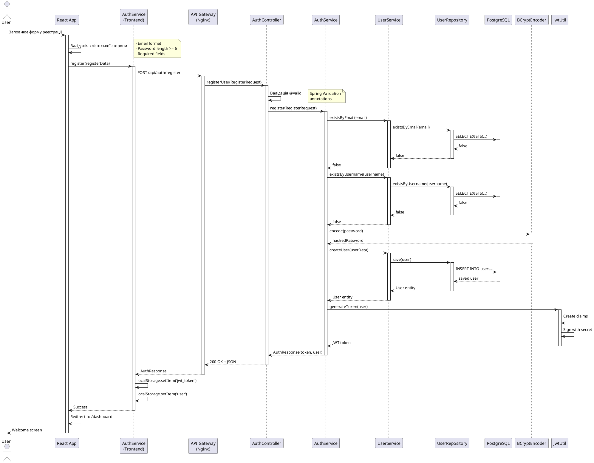
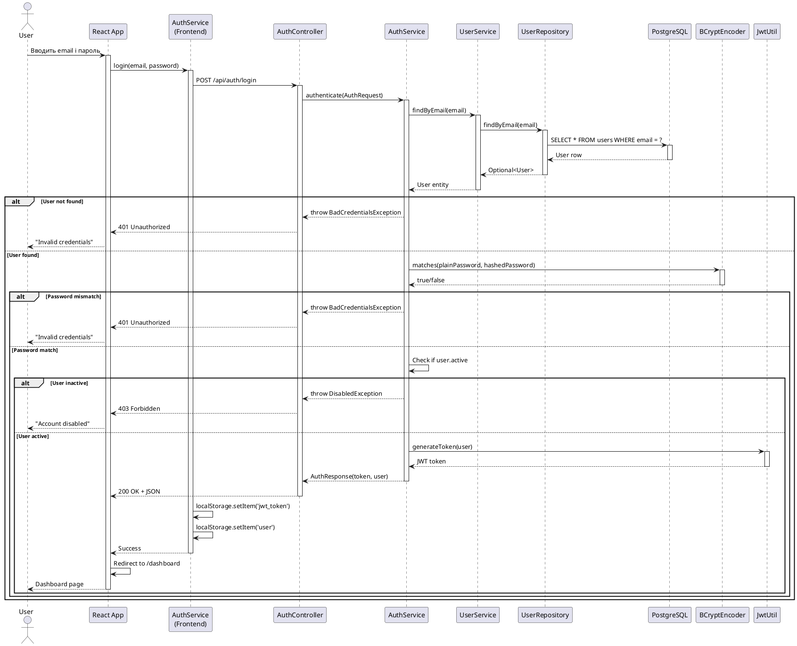
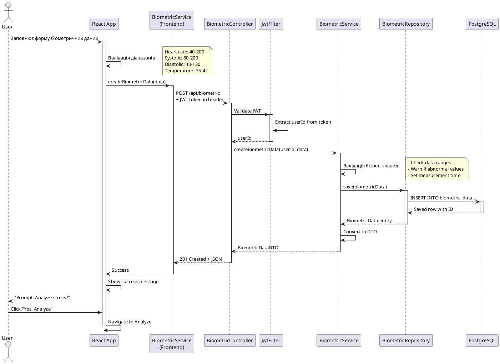
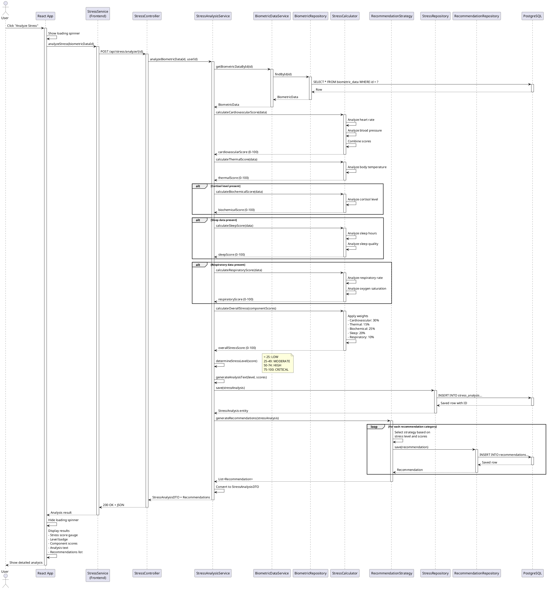
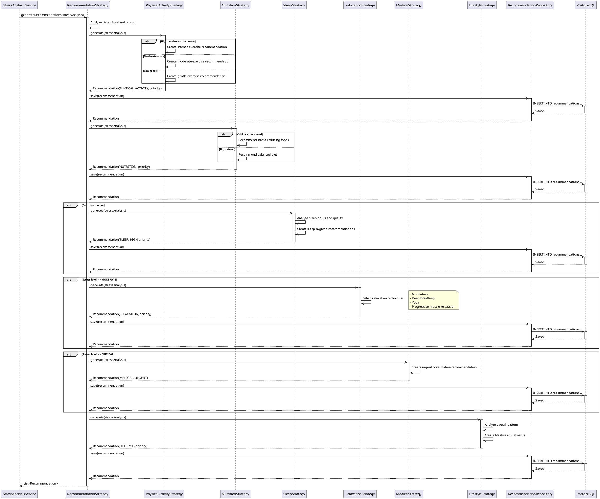
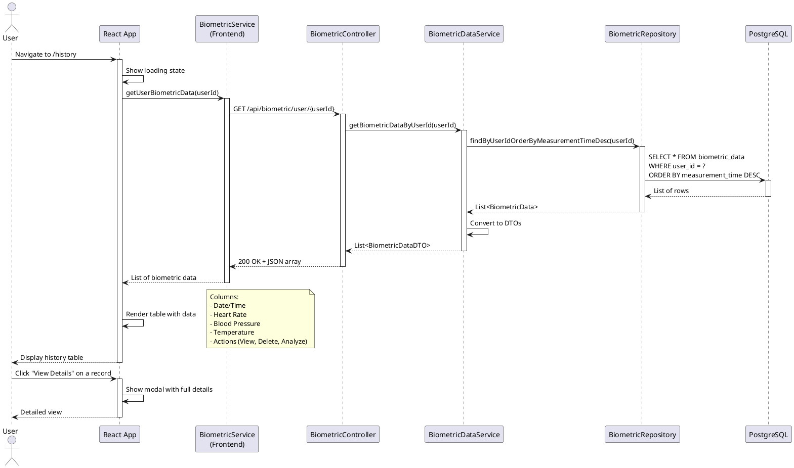
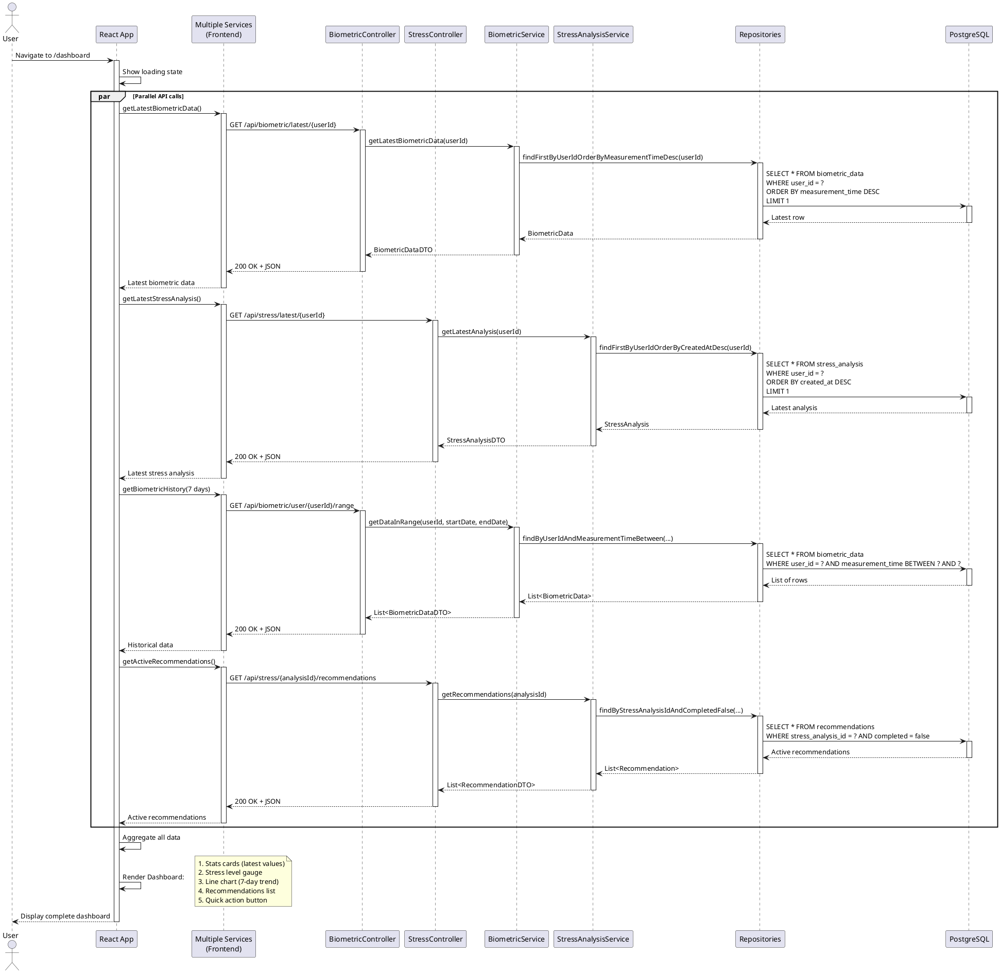
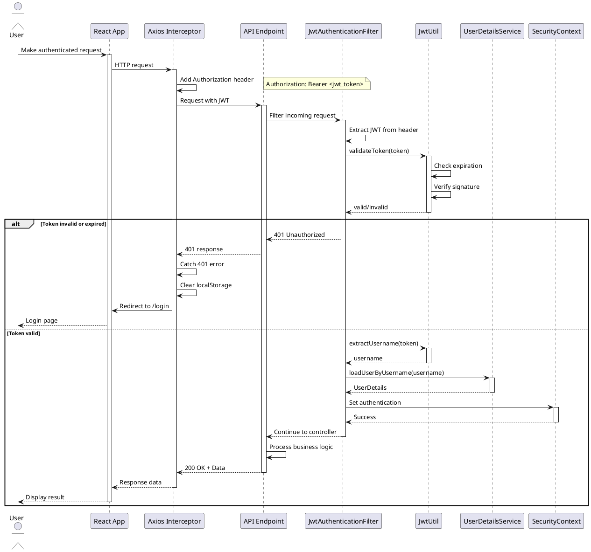
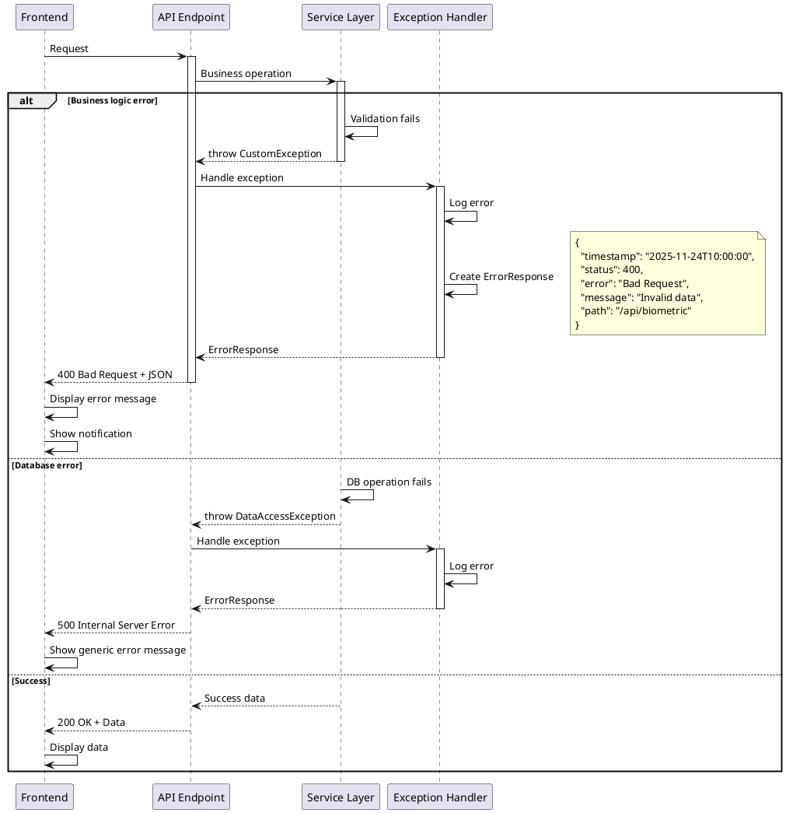

# Sequence Діаграми
## Система аналізу біометричних показників стресу

---

## Зміст
1. [Процес реєстрації користувача](#1-процес-реєстрації-користувача)
2. [Процес автентифікації](#2-процес-автентифікації)
3. [Процес додавання біометричних даних](#3-процес-додавання-біометричних-даних)
4. [Процес аналізу стресу](#4-процес-аналізу-стресу)
5. [Процес генерації рекомендацій](#5-процес-генерації-рекомендацій)
6. [Процес перегляду історії](#6-процес-перегляду-історії)
7. [Процес відображення Dashboard](#7-процес-відображення-dashboard)

---

## 1. Процес реєстрації користувача

### 1.1. Опис
Користувач заповнює форму реєстрації, система валідує дані, шифрує пароль, створює обліковий запис та генерує JWT токен.

### 1.2. Sequence діаграма

### 1.3. Кроки процесу

1. **Користувач** заповнює форму реєстрації
2. **Frontend** валідує дані на клієнті
3. **Frontend** відправляє POST запит до API
4. **AuthController** приймає запит та валідує через @Valid
5. **AuthService** перевіряє унікальність email та username
6. **BCryptEncoder** шифрує пароль
7. **UserService** створює користувача в БД
8. **JwtUtil** генерує JWT токен
9. **Frontend** зберігає токен в localStorage
10. **Frontend** перенаправляє користувача на Dashboard

---

## 2. Процес автентифікації

### 2.1. Опис
Користувач вводить облікові дані, система перевіряє їх, генерує JWT токен та повертає інформацію про користувача.

### 2.2. Sequence діаграма

---

## 3. Процес додавання біометричних даних

### 3.1. Sequence діаграма

---

## 4. Процес аналізу стресу

### 4.1. Опис
Найскладніший процес у системі. Включає розрахунок множинних компонентів стресу, визначення рівня та генерацію рекомендацій.

### 4.2. Sequence діаграма

### 4.3. Компоненти розрахунку стресу

#### Cardiovascular Score (30% ваги)
- Пульс: нормальний діапазон 60-80 уд/хв
- Систолічний тиск: нормальний < 120 мм рт.ст.
- Діастолічний тиск: нормальний < 80 мм рт.ст.

#### Thermal Score (15% ваги)
- Температура: нормальний діапазон 36.5-37.2°C

#### Biochemical Score (25% ваги)
- Рівень кортизолу: нормальний 138-690 нмоль/л

#### Sleep Score (20% ваги)
- Кількість годин: рекомендовано 7-9 годин
- Якість сну: EXCELLENT > GOOD > FAIR > POOR

#### Respiratory Score (10% ваги)
- Частота дихання: нормальний 12-20 вдихів/хв
- Сатурація кисню: нормальний > 95%

---

## 5. Процес генерації рекомендацій

### 5.1. Sequence діаграма

### 5.2. Strategy Pattern для рекомендацій

Кожна категорія рекомендацій має власну стратегію:

1. **PhysicalActivityStrategy** - рекомендації щодо фізичної активності
2. **NutritionStrategy** - рекомендації щодо харчування
3. **SleepStrategy** - рекомендації для покращення сну
4. **RelaxationStrategy** - техніки релаксації
5. **MedicalStrategy** - медичні консультації
6. **LifestyleStrategy** - загальні зміни стилю життя

---

## 6. Процес перегляду історії

### 6.1. Sequence діаграма

---

## 7. Процес відображення Dashboard

### 7.1. Sequence діаграма

---

## 8. Взаємодія з JWT автентифікацією

### 8.1. Sequence діаграма JWT потоку

---

## 9. Обробка помилок

### 9.1. Sequence діаграма обробки помилок

---

## 10. Висновки

Sequence діаграми демонструють:

1. **Повний потік даних** від користувача до БД і назад
2. **Взаємодію компонентів**: Frontend → Controller → Service → Repository → DB
3. **Асинхронну комунікацію** через REST API
4. **Безпеку**: JWT автентифікація та авторизація
5. **Обробку помилок**: різні сценарії помилок та їх обробка
6. **Складну бізнес-логіку**: аналіз стресу з множинними розрахунками
7. **Паралельні запити**: оптимізація завантаження Dashboard
8. **Паттерни проектування**: Strategy для рекомендацій

### Ключові процеси:
- ✅ Реєстрація та автентифікація з JWT
- ✅ Додавання та валідація біометричних даних
- ✅ Складний аналіз стресу з компонентними оцінками
- ✅ Генерація персоналізованих рекомендацій
- ✅ Відображення історії та Dashboard
- ✅ Обробка помилок на всіх рівнях

Ці діаграми можуть бути використані для:
- Розуміння архітектури системи
- Документування API взаємодій
- Планування тестування
- Навчання нових розробників
- Презентації проекту

**Примітка**: Всі діаграми створені у форматі PlantUML і можуть бути згенеровані у графічному вигляді.
