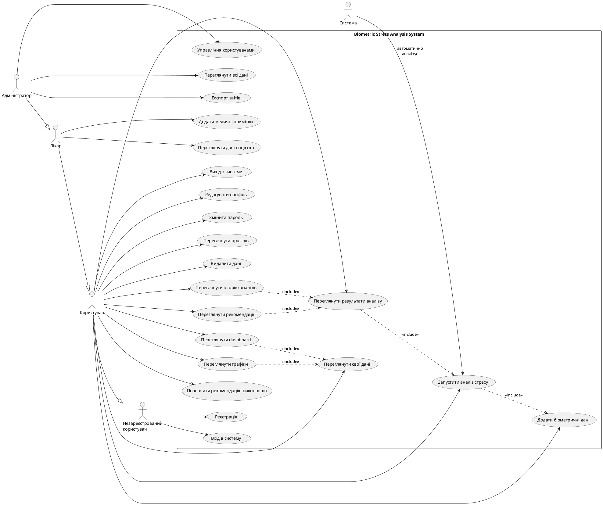
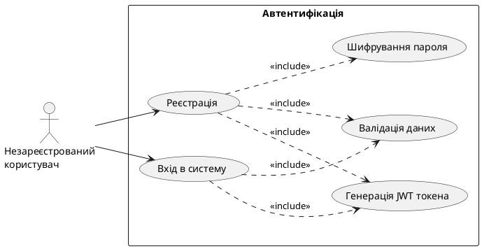
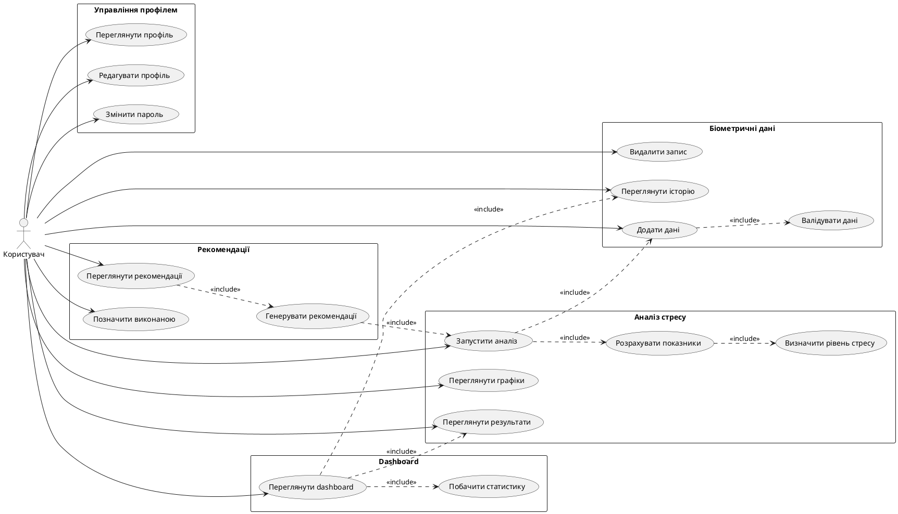
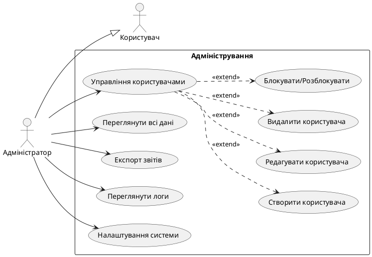

# Use Case Діаграми
## Система аналізу біометричних показників стресу

---

## Зміст
1. [Загальна Use Case діаграма](#1-загальна-use-case-діаграма)
2. [Актори системи](#2-актори-системи)
3. [Детальний опис Use Cases](#3-детальний-опис-use-cases)
4. [Діаграма для незареєстрованого користувача](#4-діаграма-для-незареєстрованого-користувача)
5. [Діаграма для зареєстрованого користувача](#5-діаграма-для-зареєстрованого-користувача)
6. [Діаграма для адміністратора](#6-діаграма-для-адміністратора)

---

## 1. Загальна Use Case діаграма

---

## 2. Актори системи

### 2.1. Незареєстрований користувач (Guest)
**Опис**: Відвідувач системи, який ще не має облікового запису.

**Можливості**:
- Реєстрація в системі
- Вхід в систему

### 2.2. Користувач (User)
**Опис**: Зареєстрований користувач системи з підтвердженим обліковим записом.

**Можливості**:
- Всі можливості незареєстрованого користувача
- Управління власним профілем
- Додавання та перегляд біометричних даних
- Запуск аналізу стресу
- Перегляд результатів та рекомендацій
- Перегляд статистики та графіків

### 2.3. Лікар (Doctor)
**Опис**: Медичний працівник з розширеними правами доступу.

**Можливості**:
- Всі можливості користувача
- Перегляд даних пацієнтів
- Додавання медичних приміток
- Моніторинг стану пацієнтів

### 2.4. Адміністратор (Admin)
**Опис**: Системний адміністратор з повним доступом до системи.

**Можливості**:
- Всі можливості лікаря
- Управління користувачами (створення, редагування, видалення)
- Перегляд всіх даних у системі
- Експорт звітів
- Налаштування системи

### 2.5. Система (System)
**Опис**: Автоматизована частина системи, що виконує фонові процеси.

**Функції**:
- Автоматичний аналіз біометричних даних
- Генерація рекомендацій
- Розрахунок показників

---

## 3. Детальний опис Use Cases

### UC1: Реєстрація

**ID**: UC1
**Назва**: Реєстрація користувача
**Актор**: Незареєстрований користувач
**Передумови**: Користувач на сторінці реєстрації
**Основний сценарій**:
1. Користувач вводить ім'я, прізвище
2. Користувач вводить email
3. Користувач вводить username
4. Користувач вводить пароль (мінімум 6 символів)
5. Користувач вводить додаткову інформацію (стать, дата народження)
6. Користувач натискає "Зареєструватися"
7. Система перевіряє унікальність email та username
8. Система шифрує пароль
9. Система створює обліковий запис
10. Система автоматично входить користувача
11. Система перенаправляє на Dashboard

**Альтернативні сценарії**:
- 7a. Email вже використовується: відображення помилки
- 7b. Username вже використовується: відображення помилки
- 6a. Не всі обов'язкові поля заповнені: відображення помилки валідації

**Постумови**: Користувач зареєстрований та автентифікований

---

### UC2: Вхід в систему

**ID**: UC2
**Назва**: Автентифікація користувача
**Актор**: Незареєстрований користувач
**Передумови**: Користувач має обліковий запис
**Основний сценарій**:
1. Користувач вводить email або username
2. Користувач вводить пароль
3. Користувач натискає "Увійти"
4. Система перевіряє облікові дані
5. Система генерує JWT токен
6. Система зберігає токен в localStorage
7. Система перенаправляє на Dashboard

**Альтернативні сценарії**:
- 4a. Невірні облікові дані: відображення помилки
- 4b. Обліковий запис неактивний: відображення повідомлення

**Постумови**: Користувач автентифікований, отримав JWT токен

---

### UC7: Додати біометричні дані

**ID**: UC7
**Назва**: Додавання біометричних показників
**Актор**: Користувач
**Передумови**: Користувач автентифікований
**Основний сценарій**:
1. Користувач переходить на форму додавання даних
2. Користувач вводить пульс
3. Користувач вводить систолічний тиск
4. Користувач вводить діастолічний тиск
5. Користувач вводить температуру тіла
6. Користувач вводить додаткові показники (опціонально)
7. Користувач натискає "Зберегти"
8. Система валідує дані
9. Система зберігає дані в БД
10. Система пропонує запустити аналіз
11. Система відображає повідомлення про успіх

**Альтернативні сценарії**:
- 8a. Дані поза допустимими межами: попередження користувача
- 10a. Користувач відмовляється від аналізу: перехід на Dashboard
- 10b. Користувач погоджується: запуск UC10

**Постумови**: Біометричні дані збережені в системі

---

### UC10: Запустити аналіз стресу

**ID**: UC10
**Назва**: Аналіз біометричних даних
**Актор**: Користувач, Система
**Передумови**: Є біометричні дані для аналізу
**Основний сценарій**:
1. Користувач вибирає запис біометричних даних
2. Користувач натискає "Аналізувати"
3. Система відображає індикатор завантаження
4. Система розраховує серцево-судинну оцінку
5. Система розраховує термальну оцінку
6. Система розраховує біохімічну оцінку (якщо є дані)
7. Система розраховує оцінку сну (якщо є дані)
8. Система розраховує респіраторну оцінку (якщо є дані)
9. Система обчислює загальний рівень стресу (0-100)
10. Система визначає категорію стресу (LOW/MODERATE/HIGH/CRITICAL)
11. Система генерує текстовий опис
12. Система зберігає результат в БД
13. Система генерує рекомендації (UC13)
14. Система відображає результати

**Альтернативні сценарії**:
- 3a. Помилка розрахунку: відображення помилки

**Постумови**: Створено запис аналізу стресу з рекомендаціями

---

### UC11: Переглянути результати аналізу

**ID**: UC11
**Назва**: Перегляд результатів аналізу стресу
**Актор**: Користувач
**Передумови**: Користувач має виконані аналізи
**Основний сценарій**:
1. Користувач переходить до історії аналізів
2. Система відображає список аналізів
3. Користувач вибирає аналіз
4. Система відображає детальні результати:
   - Загальний рівень стресу (шкала та число)
   - Категорія стресу
   - Оцінки за компонентами
   - Текстовий опис
   - Дату та час аналізу
5. Система відображає пов'язані біометричні дані
6. Система відображає рекомендації

**Альтернативні сценарії**:
- 2a. Немає аналізів: відображення повідомлення з пропозицією додати дані

**Постумови**: Користувач переглянув результати

---

### UC13: Переглянути рекомендації

**ID**: UC13
**Назва**: Перегляд персоналізованих рекомендацій
**Актор**: Користувач
**Передумови**: Є результат аналізу
**Основний сценарій**:
1. Користувач переглядає результат аналізу
2. Система відображає рекомендації по категоріях:
   - Фізична активність
   - Харчування
   - Сон
   - Релаксація
   - Медична консультація
   - Стиль життя
3. Кожна рекомендація містить:
   - Заголовок
   - Детальний опис
   - Пріоритет (LOW/MEDIUM/HIGH/URGENT)
   - Статус виконання
4. Користувач може позначити рекомендацію як виконану
5. Система оновлює статус рекомендації

**Альтернативні сценарії**:
- Немає рекомендацій: відображення загального повідомлення

**Постумови**: Користувач ознайомлений з рекомендаціями

---

### UC15: Переглянути dashboard

**ID**: UC15
**Назва**: Перегляд панелі управління
**Актор**: Користувач
**Передумови**: Користувач автентифікований
**Основний сценарій**:
1. Користувач переходить на головну сторінку
2. Система відображає Dashboard з:
   - Останніми біометричними показниками
   - Останнім аналізом стресу
   - Графіком показників за останній тиждень
   - Активними рекомендаціями високого пріоритету
   - Кнопкою швидкого додавання даних
3. Користувач може взаємодіяти з елементами
4. Користувач може перейти до детального перегляду

**Альтернативні сценарії**:
- 2a. Немає даних: відображення welcome screen з пропозицією додати перші дані

**Постумови**: Користувач отримав огляд свого стану

---

### UC17: Управління користувачами

**ID**: UC17
**Назва**: Управління користувачами системи
**Актор**: Адміністратор
**Передумови**: Адміністратор автентифікований та має роль ADMIN
**Основний сценарій**:
1. Адміністратор переходить на адмін-панель
2. Система завантажує список всіх користувачів
3. Система відображає статистику:
   - Загальна кількість користувачів
   - Кількість активних користувачів
   - Кількість адміністраторів
   - Кількість лікарів
4. Система відображає таблицю з користувачами
5. Адміністратор може виконати дії:
   - Змінити пароль користувача (UC17.1)
   - Блокувати/Розблокувати користувача (UC17.2)
   - Видалити користувача (UC17.3)

**Альтернативні сценарії**:
- 2a. Помилка завантаження: відображення повідомлення про помилку
- 5a. Спроба блокувати самого себе: відображення попередження та блокування дії
- 5b. Спроба видалити самого себе: відображення попередження та блокування дії

**Постумови**: Адміністратор має доступ до управління користувачами

**Підсценарії**:

#### UC17.1: Зміна пароля користувача
1. Адміністратор натискає кнопку "Змінити пароль" біля користувача
2. Система відкриває модальне вікно
3. Адміністратор вводить новий пароль
4. Адміністратор підтверджує новий пароль
5. Адміністратор натискає "Зберегти"
6. Система валідує паролі (співпадіння, мінімум 6 символів)
7. Система шифрує новий пароль (BCrypt)
8. Система оновлює пароль користувача в БД
9. Система відображає повідомлення про успіх
10. Система закриває модальне вікно

#### UC17.2: Блокування/Розблокування користувача
1. Адміністратор натискає кнопку "Блокувати" або "Розблокувати"
2. Система перемикає статус active користувача
3. Система оновлює дані в БД
4. Система оновлює відображення в таблиці
5. Система відображає повідомлення про зміну статусу

#### UC17.3: Видалення користувача
1. Адміністратор натискає кнопку "Видалити"
2. Система запитує підтвердження
3. Адміністратор підтверджує видалення
4. Система видаляє користувача з БД
5. Система оновлює список користувачів
6. Система відображає повідомлення про успішне видалення

---

### UC20: Переглянути дані пацієнта

**ID**: UC20
**Назва**: Перегляд даних пацієнта лікарем
**Актор**: Лікар
**Передумови**: Лікар автентифікований та має роль DOCTOR
**Основний сценарій**:
1. Лікар переходить на панель лікаря
2. Система завантажує список всіх активних пацієнтів (USER role)
3. Система відображає статистику:
   - Всього пацієнтів
   - Активні пацієнти
4. Лікар обирає пацієнта зі списку
5. Система завантажує дані обраного пацієнта:
   - Особисті дані (ім'я, прізвище, email, username)
   - Середній рівень стресу за весь час
   - Загальна кількість проведених аналізів
6. Система відображає візуальний індикатор рівня стресу з кольоровим кодуванням:
   - 0-24: Зелений (Низький)
   - 25-49: Жовтий (Помірний)
   - 50-74: Помаранжевий (Високий)
   - 75-100: Червоний (Дуже високий)
7. Лікар може переглянути детальну історію пацієнта

**Альтернативні сценарії**:
- 2a. Помилка завантаження списку: відображення повідомлення про помилку
- 5a. У пацієнта немає аналізів: відображення повідомлення "Немає даних"
- 2b. Немає пацієнтів: відображення "Немає пацієнтів"

**Постумови**: Лікар отримав інформацію про стан пацієнта

---

### UC21: Додати медичні примітки

**ID**: UC21
**Назва**: Додавання медичних приміток до профілю пацієнта
**Актор**: Лікар
**Передумови**:
- Лікар автентифікований та має роль DOCTOR
- Лікар переглядає дані конкретного пацієнта (UC20)

**Основний сценарій**:
1. Лікар вибирає опцію "Детальна історія" для пацієнта
2. Система відкриває сторінку з детальною інформацією
3. Лікар переглядає всі аналізи пацієнта
4. Лікар додає медичні примітки або рекомендації
5. Лікар зберігає примітки
6. Система зберігає примітки в БД
7. Система відображає повідомлення про успіх

**Альтернативні сценарії**:
- 2a. Помилка доступу до історії: відображення помилки
- 6a. Помилка збереження: відображення повідомлення про помилку

**Постумови**: Медичні примітки збережені та доступні для перегляду

**Примітка**: Функціонал детальної історії пацієнта та медичних приміток буде реалізований у наступних версіях системи. Наразі лікар може лише переглядати статистику пацієнтів.

---

## 4. Діаграма для незареєстрованого користувача

---

## 5. Діаграма для зареєстрованого користувача

---

## 6. Діаграма для адміністратора

---

## 7. Матриця прав доступу

| Use Case | Guest | User | Doctor | Admin |
|----------|-------|------|--------|-------|
| Реєстрація | ✓ | ✓ | ✓ | ✓ |
| Вхід в систему | ✓ | ✓ | ✓ | ✓ |
| Вихід з системи | - | ✓ | ✓ | ✓ |
| Переглянути профіль | - | ✓ (свій) | ✓ (свій) | ✓ (всі) |
| Редагувати профіль | - | ✓ (свій) | ✓ (свій) | ✓ (всі) |
| Змінити пароль | - | ✓ (свій) | ✓ (свій) | ✓ (всі) |
| Додати біометричні дані | - | ✓ | ✓ | ✓ |
| Переглянути свої дані | - | ✓ (свої) | ✓ (свої + пацієнтів) | ✓ (всі) |
| Видалити дані | - | ✓ (свої) | ✓ (свої) | ✓ (всі) |
| Запустити аналіз стресу | - | ✓ | ✓ | ✓ |
| Переглянути результати | - | ✓ (свої) | ✓ (свої + пацієнтів) | ✓ (всі) |
| Переглянути рекомендації | - | ✓ (свої) | ✓ (свої + пацієнтів) | ✓ (всі) |
| Переглянути dashboard | - | ✓ | ✓ | ✓ |
| Переглянути дані пацієнта | - | - | ✓ | ✓ |
| Додати медичні примітки | - | - | ✓ | ✓ |
| Управління користувачами | - | - | - | ✓ |
| Експорт звітів | - | - | - | ✓ |

---

## 8. Висновки

Use Case діаграми демонструють:

1. **Чітке розмежування ролей** - кожен актор має відповідні права доступу
2. **Ієрархію успадкування** - Doctor наслідує від User, Admin від Doctor
3. **Основні функції системи**:
   - Автентифікація та авторизація
   - Управління біометричними даними
   - Аналіз стресу
   - Генерація рекомендацій
   - Візуалізація та статистика
   - Адміністрування

4. **Взаємозв'язки між Use Cases** - використання include та extend для демонстрації залежностей

5. **Повний охоплення функціоналу** - всі основні можливості системи представлені у вигляді Use Cases

Діаграми можуть бути використані для:
- Розуміння функціональності системи
- Визначення вимог до тестування
- Документування API ендпоінтів
- Планування розробки
- Презентації проекту

**Примітка**: PlantUML код може бути використаний для генерації графічних діаграм у інструментах, що підтримують PlantUML (IntelliJ IDEA, VS Code з плагіном, онлайн редактори).
